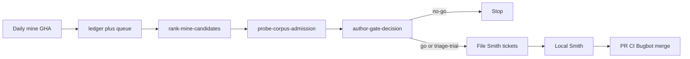

# Corpus pipeline — mine → rank → gate → Smith

Operator / coding-agent loop for discovering and admitting regex corpora,
then running **Smith** (extract → compile → fraction → triage) locally.
Daily mine setup and PAT details live in [`MINE-SETUP.md`](MINE-SETUP.md).
Admission *policy* (conditions, escape hatch) lives in
[`sweep/corpus-admission-gate.md`](../sweep/corpus-admission-gate.md).

**Boundary (by design):** mine + approve are automated / scripted; Smith is
still **human or agent-local** until [#149](https://github.com/lucas-albers-lz4/regexproof/issues/149).
Score-v1 does **not** auto-GO or file issues.



Most of this path is **deterministic Python**. Optional `--llm-draft` only
templates a draft; it never writes GO and never auto-files.

## 1. Mine (discovery)

- **GHA:** `.github/workflows/daily-mine.yml` →
  `scripts/mine-corpus-candidates.py` → commit-back
  `properties/generated/candidate-ledger.json` + `mine-queue.json`.
- **Allocator:** score-v1 (see MINE-SETUP). Day cap default 10; overflow queue
  depth 100; drain highest-score first.
- **Local dry-run:** `GITHUB_TOKEN=… python scripts/mine-corpus-candidates.py --dry-run`

## 2. Rank (sort next-to-probe)

```bash
python scripts/rank-mine-candidates.py --limit 10
```

Stdout: one NDJSON object per mined ledger row (`url`, `score`,
`score_version`, `breakdown`, stars / query / pushed_date). No network, no
writes. Process **highest score first**.

## 3. Probe + author gate (admission)

For each ranked URL:

```bash
# Draft (flagged; not schema-valid)
python scripts/probe-corpus-admission.py "$URL" -o /tmp/${name}_draft.json

# Auto NO-GO only when the author script allows it (restricted bar —
# typically zero sites / below-scale with deterministic-false boundary).
# deterministic-true / unknown never auto-approve GO.
python scripts/author-gate-decision.py /tmp/${name}_draft.json --auto \
  -o properties/generated/${name}_gate_decision.json

# Otherwise human (or agent-as-human) with met-condition evidence:
python scripts/author-gate-decision.py /tmp/${name}_draft.json --human \
  --decision go|triage-trial|no-go \
  --rationale '…' \
  --evidence 'security-boundary=…' \
  --evidence 'large-under-saturated=…' \
  -o properties/generated/${name}_gate_decision.json
```

Optional: `--llm-draft` classify-then-template only (needs `requests` in the
venv). Never use LLM output as a GO decision artifact without human authoring.

**Commit** gate JSON + ledger transitions to `main` when a batch is done.

| Decision | Meaning | Next |
|---|---|---|
| `no-go` | Do not Smith | Stop (evidence on disk) |
| `triage-trial` | Small / escape-hatch admit | File ticket → Smith |
| `go` | Full admit | File ticket → Smith (priority) |

## 4. Process tickets (before Smith)

Mine does **not** open Smith issues. After a ranked batch of gates:

1. Open a **tracking** issue for the batch (label `tracking`).
2. Open one **Smith** issue per `go` / `triage-trial` (labels
   `enhancement`, `status:ready`, `scanner-pipeline`): pin, URL, probe sites /
   dialects, noise warnings, acceptance = artifacts on `main` or superseding
   `no-go`.
3. Process tickets **locally** against those issues (priority: GO first).

Example wave: umbrella [#154](https://github.com/lucas-albers-lz4/regexproof/issues/154)
→ hippo Smith [#155](https://github.com/lucas-albers-lz4/regexproof/issues/155)
merged via PR [#161](https://github.com/lucas-albers-lz4/regexproof/pull/161).

## 5. Smith (local extract → fraction → triage)

Template: [`batch/corpora/dompurify/README.md`](../batch/corpora/dompurify/README.md),
[`batch/corpora/hippo/README.md`](../batch/corpora/hippo/README.md).

### 5a. Materialize pin

```bash
PIN=<corpus_pin from gate>
git clone <url> /tmp/<corpus>
git -C /tmp/<corpus> fetch --depth 1 origin "$PIN"
git -C /tmp/<corpus> checkout "$PIN"
mkdir -p batch/corpora/<corpus>
ln -sfn /tmp/<corpus> batch/corpora/<corpus>/rules
test "$(git -C /tmp/<corpus> rev-parse HEAD)" = "$PIN"
```

Add `batch/corpora/<corpus>/README.md` (pin, allowlist, measure commands).
`batch/corpora/*/rules` is gitignored.

### 5b. Scope allowlist (mandatory on noisy monorepos)

Admission walk skips `node_modules` / `vendor`, **not** swagger / highlight /
ckeditor / minified bundles checked into the tree. Probe site counts can be
~95% vendor (hippo: 2899 → 55 after allowlist + precise extract).

- Prefer explicit `files:` in `CORPUS_MANIFESTS` (DOMPurify / hippo lesson).
- For ecma wave corpora use extractor **`js_precise_dir`**
  (`extract_js_precise`) — **not** legacy `js_dir` / `extract_js` (import-path
  `/…/` false positives).
- Drop tests, webpack/gulp, localization-only, and obvious third-party packs
  unless they are the security boundary under study.

### 5c. Register + measure

In [`regexproof/batch/runner.py`](../regexproof/batch/runner.py):

- Add `CORPUS_MANIFESTS["<corpus>"]` (`path`, `files`, `dialect`, `extractor`,
  `repo`, `corpus_pin` / `commit`, `budget`, `security_tool`).
- Add name to `WAVE_CORPORA`.

```bash
python scripts/measure-corpus-fraction.py --corpus <name> --assert-determinism
```

- Fraction **≥ 0.30** and non-trivial scoped surface → batch.
- Fraction **&lt; 0.30** or surface collapses to noise → supersede gate to
  `no-go` (or keep `triage-trial` only if findings pipeline still useful) with
  Smith evidence; still commit fraction/inventory.

### 5d. Batch

```bash
python -m regexproof.batch --corpus <name>
```

Expected under `properties/generated/` (and triage):

- `<name>_encodable_fraction.json`, `<name>-inventory.ndjson`
- `<name>.ndjson`, `<name>_batch.md`, `<name>_batch_summary.json`
- `properties/triage/<name>.ndjson` when emitted

**Do not commit** clobbered globals from a single-corpus run
(`batch_summary.json`, `batch_pair_counts.json`, `batch_repro.sha256`) unless
you intentionally re-ran the full pilot `all` set — restore them if overwritten.

### 5e. Java slice (optional)

Runner has no java extractor. Reuse
`scripts/java-html-sanitizer-triage.py`:

```bash
python scripts/java-html-sanitizer-triage.py \
  --root batch/corpora/<name>/rules \
  --corpus <name> \
  --pin "$PIN" --url <url> \
  --files path/to/Main.java   # relative; required with non-default corpus
```

Default artifact stem for non-`java-html-sanitizer` corpora is
`<corpus>_java` (avoids clobbering ecma `hippo_encodable_fraction.json`).
`--pin` and `--url` are required when `--corpus` is not the default.
Native Java dialect remains [#150](https://github.com/lucas-albers-lz4/regexproof/issues/150).

### 5f. Ship

1. One PR: README + manifest/`WAVE_CORPORA` + generated artifacts (+ triage
   script tweaks if needed).
2. CI green → **Bugbot** on branch changes (required for non-trivial PRs) →
   fix findings → merge.
3. Close the Smith issue; comment the batch umbrella.

## Scan order (cheat sheet)

| Priority | Action | Tooling |
|---:|---|---|
| 1 | Ensure daily mine healthy | MINE-SETUP / `gh run list --workflow=daily-mine.yml` |
| 2 | Rank mined ledger | `rank-mine-candidates.py --limit N` |
| 3 | Probe + gate each URL | `probe-…` → `author-gate-decision.py` |
| 4 | Commit gates + ledger | git |
| 5 | File Smith tickets (GO first) | `gh issue create` |
| 6 | Smith locally per ticket | measure → batch → PR |
| 7 | Next ticket in umbrella | repeat 6 |

## Related

- [`MINE-SETUP.md`](MINE-SETUP.md) — GHA, PAT, score-v1 table
- [`REPORTING.md`](REPORTING.md) — NDJSON / batch field contracts
- [`PLAYBOOK.md`](PLAYBOOK.md) — corpus-wave measure → matrix loop
- AGENTS.md — property-encoding workflow (orthogonal; runs *after* Smith
  when encoding shape properties)
